# 🧠 KoRA: Kolmogorov-inspired Compositional Adapters for Robust Fine-Tuning

[]()
[](LICENSE)
[]()
[]()

**KoRA** is a novel **Parameter-Efficient Fine-Tuning (PEFT)** strategy that introduces **inter-adapter communication** to learn **robust, generalizable representations** that transfer across domains — addressing a key limitation in methods like **LoRA**.

---

## 📚 Table of Contents
- [🎯 The Problem: The Brittleness of Specialization](#-the-problem-the-brittleness-of-specialization)
- [💡 The KoRA Solution: From Specialists to a Coordinated Team](#-the-kora-solution-from-specialists-to-a-coordinated-team)
- [🔧 Architecture: How It Works](#-architecture-how-it-works)
- [📊 Experimental Results](#-experimental-results)
  - [4.1 In-Domain Specialization (CIFAR-100)](#41-in-domain-specialization-cifar-100)
  - [4.2 Cross-Domain Generalization (Tiny-ImageNet)](#42-cross-domain-generalization-tiny-imagenet)
  - [4.3 Representation Analysis (CKA)](#43-representation-analysis-cka)
  - [4.4 Dense Prediction (NYU Depth V2)](#44-dense-prediction-nyu-depth-v2)
- [🚀 Getting Started](#-getting-started)
- [🗺️ Roadmap & Future Work](#️-roadmap--future-work)

---

## 🎯 The Problem: The Brittleness of Specialization

Parameter-Efficient Fine-Tuning (PEFT) methods like **LoRA** have been revolutionary — allowing us to adapt massive pre-trained models to specific tasks at a fraction of the cost.  
However, this efficiency comes with a hidden price: **brittleness**.

LoRA injects small, **independent adapters** into each layer.  
While highly effective for a **single task**, these adapters often **overfit**, learning features that don’t generalize well.  
When a LoRA adapter trained on one task is transferred to another (especially across domains), **performance drops significantly**.

| Method | Source Task (CIFAR-100) | Transfer Task (Tiny ImageNet) |
|:--|:--:|:--:|
| **LoRA** | 92.48% (Excellent Specialization) | 71.04% (Poor Generalization) |
| **KoRA** | 83.96% (Controlled Specialization) | 97.37% (Superior Generalization) |

> ❓ Can we create an adapter that learns **fundamental, transferable knowledge**, even if it sacrifices a few points on the source task?

---

## 💡 The KoRA Solution: From Specialists to a Coordinated Team

The key limitation of LoRA is **isolation** — the query, key, and value adapters in a transformer block never communicate.

KoRA changes this paradigm.

Inspired by the **Kolmogorov–Arnold Representation Theorem** (which states that complex functions can be decomposed into compositions of simpler ones), KoRA introduces a **learnable CompositionBlock**.

### 🧩 Analogy

- **LoRA**: A team of three brilliant specialists (Query, Key, Value) who **never talk**.
- **KoRA**: The same team, but they **discuss their findings** with a **manager** (the CompositionBlock), who synthesizes their insights into a unified decision.

This **CompositionBlock** creates **functional dependency** between adapters, forcing them to learn a **shared, compositional representation** of the task.

---

## 🔧 Architecture: How It Works

The architecture is a **simple but powerful** extension of LoRA.

### Step 1. Generate Low-Rank Signals

For input **x**, standard LoRA adapters compute deltas for Query, Key, and Value:

\[
\delta_q, \delta_k, \delta_v
\]

### Step 2. Compose the Signals

Instead of applying them directly, concatenate and pass through the **CompositionBlock** (an MLP):

\[
\delta_{comp} = \text{CompositionBlock}([\delta_q ; \delta_k ; \delta_v])
\]

### Step 3. Apply a Holistic Update

This single composed delta is then applied to the model using a **learnable gate** \( g \):

\[
v_{new} = v_{orig} + g \cdot \delta_{comp}
\]

> The **gate \( g \)** starts at zero, ensuring optimization stability and allowing the model to gradually “turn up the volume” on the compositional signal.

---

### 🧮 Figure 1: KoRA CompositionBlock Flow

```mermaid
flowchart TB
    subgraph KoRA_Adapter_Module
        direction TB
        IN([Input x]) --> Q_ADAPTER["Q-Adapter (LoRA)"]
        IN --> K_ADAPTER["K-Adapter (LoRA)"]
        IN --> V_ADAPTER["V-Adapter (LoRA)"]

        Q_ADAPTER --> DELTA_Q("δ_q")
        K_ADAPTER --> DELTA_K("δ_k")
        V_ADAPTER --> DELTA_V("δ_v")

        DELTA_Q --> CONCAT["Concat [δ_q, δ_k, δ_v]"]
        DELTA_K --> CONCAT
        DELTA_V --> CONCAT

        CONCAT --> COMPOSE_BLOCK["CompositionBlock (MLP)"]
        COMPOSE_BLOCK --> DELTA_COMP("δ_comp")
    end

    subgraph Applying_Update
        direction TB
        DELTA_COMP --> GATE_MULT["⊗ (Multiply)"]
        GATE["g (Learnable Gate)"] --> GATE_MULT
        
        V_ORIG["V_original"] --> ADD["⊕ (Add)"]
        GATE_MULT --> ADD
        
        ADD --> V_NEW["V_new"]
    end
    
    IN --> V_ORIG
```



---

## 📊 Experimental Results

### 4.1 In-Domain Specialization (CIFAR-100)

Fine-tuned for 5 epochs on CIFAR-100.

| Tuning Method | Params Tuned (%) | CKA Sim. | Accuracy (%) | F1 Score |
|:--|:--:|:--:|:--:|:--:|
| **LoRA (r=8)** | 1.45 | 0.73 | 92.48 | 0.924 |
| **Adapter Fusion** | 1.45 | 0.71 | 92.22 | 0.922 |
| **KoRA (d_comp=4)** | 1.80 | 0.76 | 83.96 | 0.840 |
| **KoRA (d_comp=8)** | 2.18 | 0.76 | 84.19 | 0.842 |

> 🧠 **Analysis:**  
> LoRA dominates on single-task performance.  
> KoRA shows **higher CKA similarity**, suggesting **more structured learning**, even though raw accuracy drops slightly — a deliberate trade-off for generalization.

---

### 4.2 Cross-Domain Generalization (Tiny ImageNet)

Models pre-trained on CIFAR-100, fine-tuned for one epoch on **1% of Tiny ImageNet**.

| Tuning Method | Accuracy (%) | F1 Score |
|:--|:--:|:--:|
| **LoRA (r=8)** | 71.04 | 0.8307 |
| **Adapter Fusion** | 46.67 | 0.6364 |
| **KoRA (d_comp=4)** | 97.37 | 0.9867 |
| **KoRA (d_comp=8)** | 98.24 | 0.9911 |

> 🚀 **Analysis:**  
> KoRA’s compositional approach achieves **near-perfect transfer** — dramatically outperforming LoRA.  
> Suggests that KoRA learns **more robust, transferable features**.

---

### 4.3 Representation Analysis (CKA)

Preliminary **CKA (Centered Kernel Alignment)** shows that KoRA learns **more structured, cross-layer dependencies**.


> **Figure 2:**  
> CKA similarity matrices for KoRA (left) and LoRA (right) between blocks 0, 6, and 11.  
> KoRA maintains **higher similarity between distant layers** (0.50 vs 0.45), indicating a **more unified feature hierarchy**.

---

### 4.4 Dense Prediction (NYU Depth V2)

Evaluated on **1% of NYU Depth V2** (monocular depth estimation).

| Method | Metric | Score |
|:--|:--|:--:|
| **LoRA** | RMSE | 0.2800 |
|  | AbsRel | 0.5629 |
| **KoRA** | RMSE | 0.3327 |
|  | AbsRel | 0.6271 |

> 📉 **Analysis:**  
> LoRA performs better here — showing KoRA’s current **bias towards classification** tasks.  
> Future work will adapt KoRA for **dense spatial reasoning**.

---

## 🚀 Getting Started

### Prerequisites
- Python 3.8+
- PyTorch 2.0+
- Transformers
- timm

### Installation

```bash
git clone https://github.com/onepunchmonk/kora.git
```

---

## 🗺️ Roadmap & Future Work

The goal is to validate and refine KoRA to establish **compositional adaptation** as a superior approach for **out-of-domain generalization**.

### 🎯 Objective 1: Architectural Refinement
- [ ] Explore **attention-based** inter-adapter communication  
- [ ] Experiment with **different basis functions** for adapter projections

### 🧪 Objective 2: Extensive Empirical Validation
- [ ] Extend evaluation to **Object Detection (MS COCO)**  
- [ ] Extend evaluation to **Semantic Segmentation (MS COS & PASCAL VOC)**  
- [ ] Conduct **ablation studies** on CompositionBlock complexity and gate impact  
- [ ] Investigate **dense prediction** performance further

### 🧩 Objective 3: Theoretical and Representation Analysis
- [ ] Perform **full-layer CKA analysis**  
- [ ] Study **Kolmogorov complexity** connection by comparing parameter compressibility (KoRA vs LoRA)

---

**🧭 Summary:**  
KoRA reframes fine-tuning as a **cooperative, compositional process**, not a set of isolated perturbations — achieving **robust generalization** and **domain transferability** far beyond current PEFT methods.

---
